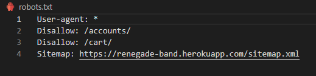

# WELCOME TO RENEGADE BAND PAGE 


[View the live project here.](https://renegade-band.herokuapp.com/)


This project was built for Code Institute's Portfolio 5 Assessment.  
It was built via Full-stack development program through Django Framework.  
More on Technologies used can be found below.

Site is a fictitious e-commerce band page for American Metal Band called **Renegade**.  
It allows users to access band's **merch** & **tour events** but also offers information on band members, about section and band songs, especially **new songs** *(singles)* which can be found on home page.

Project Idea came from my own interest to build a site a friend who actively plays in a band. It is a good opportunity to showcase the skills learned over the course.


# Table of Contents
- [Introduction](#welcome-to-renegade-band-page)
- [UX](#ux)
    - [User Stories](#user-stories)
        - [Site User](#site-user)
        - [Site Shopper](#site-shopper)
        - [Site Owner](#site-owner)
    - [Agile Methodology]()
    - [The Scope](#the-scope)
      - [Main Site Goals](#main-site-goals)
  - [Design](#design)
      - [Colours](#colours)
      - [Typography](#typography)
      - [Imagery](#imagery)
      - [Wireframes](#wireframes)
  - [Data Model](#data-model)
  - [Features](#features)
    - [Landing Page](#landing-page)
    - [Navbar](#navbar)
        - [Mobile Navbar](#mobile-navbar)
    - [Home](#home)
        - [Home - Streaming](#home---streaming)
        - [Home - Newsletter](#home---newsletter)
        - [Home - New Songs](#home---new-songs)
        - [Other Home Page Layouts](#other-home-page-layouts)
    - [Footer](#footer)
    - [Store](#store)
        - [Product Info](#product-info)
        - [Add Product](#add-product)
        - [Edit Product](#edit-product)
        - [Delete Product](#delete-product)
        - [Other Store Page Layouts](#other-store-page-layouts)
    - [Tour](#tour)
        - [Add Tour Event](#add-tour-event)
        - [Edit Tour Event](#edit-tour-event)
        - [Delete Tour Event](#delete-tour-event)
    - [About](#about)
        - [Member Info](#member-info)
        - [Add Member](#add-member)
        - [Edit Member](#edit-member)
        - [Delete Member](#delete-member)
    - [Videos](#videos)
        - [Add Song](#add-song)
        - [Edit Song](#edit-song)
        - [Delete Song](#delete-song)
    - [Cart](#cart)
    - [Checkout](#checkout)
        - [Stripe](#stripe)
        - [Order Confirmation](#order-confirmation)
    - [Account](#account)
    - [All Auth](#all-auth)
    - [Signup](#signup)
    - [Login](#login)
    - [Logout](#Logout)
    - [Password Reset](#password-reset)
    
  

# UX

### User stories 

#### Site User

- As a Site User I can Easily register for an account so that I have a personal account and be able to view my profile.
- As a Site User I can Easily login or logout so that I can access my personal account information.
- As a Site User I can Easily recover my password in case I forget it so that I can recover acccess to my account.
- As a Site User I can Receive an email confirmation after registering so that I can verify that my account registration was successful.        
- As a Site User I can Have a personalized user profile so that I can view my personal order history and order confirmations and save my payment information.


#### Site Shopper
- As a Shopper I can View a list of products so that I can Select some to purchase.
- As a Shopper I can View individual product details so that I can identify the price and product info.
- As a Shopper I can Easily view the total of my basket so that I can see the current amount of my spending and avoid going overboard.
- As a Shopper I can Sort the list of available products so that I can easily identify the best prices and sort from low to high.
- As a Shopper I can Search for a product by name or description so that I can find a specific product I'd like to purchase.
- As a Shopper I can Easily select the size and quantity of a product when purchasing it so that I can ensure I dont accidentally select the wrong product quantity or size.
- As a Shopper I can View items in my bag to be purchased so that I can identify the total cost of my purchase and all items I will receive.
- As a Shopper I can Adjust the quantity of individual items in my bag so that I can easily make changes to my purchase before checkout.
- As a Shopper I can Easily enter my payment information so that I can check out quickly and with no hassle.
- As a Shopper I can Feel my personal and payment information is safe and secure so that I can confidently provide the needed information to make a purchase.
- As a Shopper I can View an order confirmation after checkout so that I can verify that I haven't made any mistakes.
- As a Shopper I can Receive an email confirmation after checking out so that I can keep the confirmation of what I've purchased for my records.


#### Site Owner
- As a Site Owner I can Add Tour Event so that Fans can see our current tour lineup with Country, City and Venue.
- As a Site Owner I can Add Band Members so that I can add the new members of the band.
- As a Site Owner I can Add a product so that I can add new items to my store.
- As a Site Owner I can Edit/update a products so that I can change product prices, descriptions, images and other product criteria.
- As a Site Owner I can Delete a product so that I can remove items that are no longer for sale.
- As a Site Owner I can Edit/Delete band members so that I can keep the site updated in case of change in band members or edit their information.
- As a Site Owner I can Edit and Delete Tour Event so that I can keep the tour lineup updated, change information and also delete tour events that are cancelled.
- As a Site Owner I want expired Tour Event to automatically hide so that Fans or customers are not seeing old/expired tour events.
- As a Site Owner I can Add Music Video Link so that Fans or Customers can easily see our videos and hear our music.
- As a Site Owner I can Add New Songs so that they can also be rendered on our home page for fans and customers to check bands new songs.
- As a Site Owner I can Edit/Delete music video links so that I can remove the songs or update the links.
- As a Shopper I can see current number of items in my cart so that I can know exact amount of items I am ordering, including multitude of same items.


As you can see below, all of the user stories are completed and they have all been tested as they were being implemented and through testing phase.  

<details><summary>GITHUB USER STORIES   (🔻click to view 🔻)</summary>

</details>
    
<br>

### Agile Approach
Site functionality and development all through this project was managed using GitHub Projects which can be found here [Renegade Band User Stories](https://github.com/users/anluke/projects/4).

<br>

### The Scope

#### Main Site Goals

- To provide users with a good website experience with Band Merch & Tour Events.
- To provide users with a visually pleasing website that is intuitive and easy to navigate.
- To provide a website with a clear purpose.
- To provide tools that allow users to search for products.
- To provide users with an easy and safe way to buy their products.
- To provide users with breadcrumbs menu so they can more easily navigate through the site.

<br>

#### Colours

<br>

- Color Scheme is simple but still modern. As I'm a fan of **"Dark Mode on everything"**, I decided to go with Black background with white text. Hero Image touches on **Orange** and **Yellow** color with darker tones. **Cancel** button is in **warning-red** color while **Tour** buttons are all blue. Most of the continuity buttons are colored in **warning-color** as that gives a clear distinction of a button navigation to next step. Warning/Danger colors have nothing to with names, I just used them directly from bootstrap as they represented the best option for me.  
Checkout button inside the **toast** checkout popup is also labeled light blue.  
**EDIT** button is left white, **DELETE** is red and ***Update** is light blue.  
Black color was used for both header and footer with white text.


#### Typography

- Roboto font is used as the main font for the whole project.

#### Imagery

- Most of the images are **.PNG** and **.JPEG** format.  
Future improvement could be made by transforming them all into **.WEBP** file to improve the site performance but due to the length of this project I realised that a bit too late and left it as a future minor improvement.


#### Wireframes

- <details><summary>Desktop Wireframes (🔻click to view 🔻)</summary>
    
    
    
    
    
    
    
    
    
    
    
    
    
    
       
    </details>

    - <details><summary>ADMIN Desktop Wireframes (🔻click to view 🔻)</summary>
        
        
        
        
        
        
        
        
        
        
        
        
        </details> 

    <br>

    <details><summary>Tablet Wireframes (🔻click to view 🔻)</summary>
    
    
    
    
    
    
    
    
    </details>

    <br>

    <details><summary>Mobile Wireframes (🔻click to view 🔻)</summary>
    
    
    
    
    
    
    </details>

    <br>

## DATA MODEL
<br>


# FEATURES

### Landing Page


- The Landing page features a navbar at the top with page title over the **HERO** image, **shop** button that leads the user directly to the user and cover of the new album that's currently on preorder.<br>

<br>

### NAVBAR


- Page Navbar is all dark color with **Renegade** band logo on the left side.  
Menu holds **HOME**, **STORE**, **TOUR**, **ABOUT** & **VIDEOS** as navigation link.  
It features a search bar with search icon button and two icons at the far right side: **ACCOUNT** and **CART**.<br>


- Above is the site owner navbar which display **chevron** dropdown icon that holds site owner management functions.  
In this case it's only **ADD** option for each of the Menu links. Furthermore, once you're in the section, you can EDIT and DELETE the items.<br>


#### Mobile Navbar

- Mobile navbar has a handy hamburger menu with same **chevron** arrows in site owner mode but only this time pointing right.

<details><summary>MOBILE NAVBAR / CART FILLED (🔻click to view 🔻)</summary>

</details>

<details><summary>ADMIN MOBILE NAVBAR / CART EMPTY (🔻click to view 🔻)</summary>

</details>
<details><summary>ADMIN MOBILE NAVBAR / OPTION (🔻click to view 🔻)</summary>

</details>


<br>


## HOME


### Home - Streaming


- Streaming platform section has all the links to todays streaming music service. I have added **Apple Music**, **Spotify**, **YouTube**, **Amazon Music** & **Deezer**.<br>

<br>

### Home - Newsletter


- Newsletter section that gives users an opportunity to subscribe for newsletter. It has an email input form with tiny description and also band **Facebook** group is just below.<br>

<br>


If successfully sent, message will appear below the input form.<br>

<br>


If you submit *(for example)* an empty form it will let you know that **Field can't be empty**.<br>


<details><summary>NEWSLETTER SUCCESS EMAIL   (🔻click to view 🔻)</summary>
    
</details>

<br>

### Home - New Songs
- New songs section display songs that have been marked as **NEW** during the process of adding the songs. Due to picture being too large, It's hidden within 'DETAIL' view.
<details><summary>NEW SONGS SECTION   (🔻click to view 🔻)</summary>
    
</details>


### Home - Tours
- Tour section that displays all of the current Band Tour Events. Due to picture being too large, It's hidden within 'DETAIL' view.
<details><summary>HOME TOURS SECTION   (🔻click to view 🔻)</summary>
    
</details>


<br>

### Other Home Page Layouts

<details><summary>DESKTOP HOME PAGE (🔻click to view 🔻)</summary>

</details>

- <details><summary>ADMIN DESKTOP HOME PAGE (🔻click to view 🔻)</summary>
    
    </details>

<details><summary>HOME SECTIONS MOBILE (🔻click to view 🔻)</summary>

</details>

<br>

## FOOTER


- Page footer that displays same streaming section as we mentioned before only in a smaller format. It also holds a band logo that can be seen in the navbar.<br>


<br>

## STORE

Desktop store with all of the other features of the website like navbar, footer, etc.  
Please click on detailed views to see more.
<details><summary>DESKTOP STORE (🔻click to view 🔻)</summary>

</details>

- <details><summary>ADMIN DESKTOP STORE (🔻click to view 🔻)</summary>
    
    </details>
<br>

Store also has a nice and simple sorting function.  
It allows us to sort by **Name(A-Z)**, **Name(Z-A)**, **Price, High to Low**, **Price, Low to High**.


<br>
<br>
<br>
<br>
<br>
TU SMO STALI SA NAVIGACIJOM, SREDI KASNIJE
<br>
<br>
<br>
<br>
<br>
<br>


### Product Info


- Product info has a product image on the left side, product info on the right side of the picture with product price, production description and quantity input where you can add more then 1 item.
- If you are in the admin mode you can also see more options such as **EDIT** and **DELETE**. These are only available to site owners/superusers.  
- **Add to cart** or **keep shopping** buttons are also at the bottom of production info section.

<br>

### Add Product


- A form to add the product to our shopping store. If you are a site owner you can add items to the store.
- **Cancel** and **Add Product** buttons on the bottom of the form.  
- You will also see a Toast notification on the top right corner that will state the name of the product you added.

<br>

### Edit Product


- A form to edit the product. It's exactly the same as add product form only difference is that you are editing existing product and only have an option to **Cancel** or **Save** with their distinguishable colors.  
- You will also see a Toast notification on the top right corner that states which product you're editing.

<br>

### Delete Product

- To delete a product is very easy. Just click on **DELETE** button either in the Product Info itself or in the Store Menu.  
- You will also see a Toast notification on the top right corner that states which product you deleted.


### Other Store Page Layouts

<details><summary>DESKTOP STORE PAGE (🔻click to view 🔻)</summary>

</details>

<details><summary>ADMIN DESKTOP STORE PAGE (🔻click to view 🔻)</summary>

</details>

<br>

<details><summary>MOBILE ADMIN STORE (🔻click to view 🔻)</summary>

</details>

<details><summary>MOBILE ADMIN ADD PRODUCT (🔻click to view 🔻)</summary>

</details>

<details><summary>MOBILE ADMIN EDIT PRODUCT (🔻click to view 🔻)</summary>

</details>


## TOUR

Tour section with all of the upcoming tour events. The tickets can be purchased directly from ticketmaster. Every tour event will be devided with horizontal line and will have **EDIT** and **DELETE** option in the admin mode.  
As Events expire or their date moves closer to an end, those expired events will disappear from the site.  

- Since images are rather large I have put them in the details view. There are couple of variations to see.  
- Please click to expand.
<details><summary>DESKTOP TOUR PAGE (🔻click to view 🔻)</summary>

</details>
<details><summary>DESKTOP ADMIN TOUR PAGE (🔻click to view 🔻)</summary>

</details>


<br>

<details><summary>MOBILE TOUR PAGE (🔻click to view 🔻)</summary>

</details>
<details><summary>MOBILE ADMIN TOUR PAGE (🔻click to view 🔻)</summary>

</details>


### Add Tour Event

- A form to add the tour event to our tour section.
- **Cancel** and **Add Event** buttons on the bottom of the form.  
- You will also see a Toast notification on the top right corner that will state the name of the tour event you added.
<details><summary>DESKTOP ADD TOUR EVENT (🔻click to view 🔻)</summary>

</details>
<details><summary>MOBILE ADD TOUR EVENT (🔻click to view 🔻)</summary>

</details>

<br>

### Edit Tour Event

- A form to edit the Tour Evemt. It's exactly the same as add Tour Event only difference is that you are editing existing Tour event and only have an option to **Cancel** or **Save** with their distinguishable colors.  
- You will also see a Toast notification on the top right corner that states which event you're editing by Venue Name.
<details><summary>DESKTOP EDIT TOUR EVENT (🔻click to view 🔻)</summary>

</details>
<details><summary>MOBILE EDIT TOUR EVENT (🔻click to view 🔻)</summary>

</details>
<br>

<br>

### Delete Tour Event
- Deleting a tour event is very easy. Just click on **DELETE** button on the Tour page.  
- You will also see a Toast notification on the top right corner that states which product you deleted.  


<br>


## ABOUT


- About section has all the info about the band members. It also has a brief description and history of the band.
At the forefront are the band members with interactive images.  

- You need to click on a member to enter **Member Management** options.
<br>
<br>

***For Current Band Members Lineup I Have Selected Dearly Departed Musicians From Metal Community.***  
***That is the reason I have applied 'MonoChrome' Effect to all the images.***

<br>

As a site owner you can see the yellow **Add Band Member** button. This allows admins to add members directly from the about page.  
It also states that to **Edit** or **Delete** a band member you need to click on a Member first.  
More info can be found in the details views below:
<details><summary>DESKTOP ADMIN ABOUT PAGE (🔻click to view 🔻)</summary>

</details>
<details><summary>MOBILE ADMIN ABOUT PAGE (🔻click to view 🔻)</summary>

</details>

<br>


### Member Info

- In the about member info page you can see current Member's: **Name**, **Quick BIO**, **Age**, **Genre**, **Role** & **Description**.

Below are Site Owner views of the same page. As you can see deleting or editing a member is possible directly as a site owner.  
Just click on **EDIT** or **DELETE** buttons in the view.

<details><summary>DESKTOP ADMIN MEMBER INFO (🔻click to view 🔻)</summary>

</details>
<details><summary>MOBILE ADMIN MEMBER INFO (🔻click to view 🔻)</summary>

</details>

<br>

### Add Member

Adding a Band Member is easy. When you click on the yellow **Add Band Member** button we mentioned earlier it will automatically open a form. You will be able to put in member's **Name**, **Quick BIO**, **Age**, **Genre**, **Role** & **Description**.  
- Of course there is an Image Input as well and it's mandatory for the proper functionality of the page.
- You will also see a Toast notification on the top right corner that will state the name of the band member you added.

<details><summary>DESKTOP ADD MEMBER (🔻click to view 🔻)</summary>

</details>
<details><summary>MOBILE ADD MEMBER (🔻click to view 🔻)</summary>

</details>


### Edit Member

Editing a Band Member is same as adding. Just click on **EDIT** button that's in Member Info Page. You will be able to change member's **Name**, **Quick BIO**, **Age**, **Genre**, **Role** & **Description**.  
- You can also change Member's Image.
- You will also see a Toast notification on the top right corner that states which band member you're editing by member's Name.


<details><summary>DESKTOP EDIT MEMBER (🔻click to view 🔻)</summary>

</details>
<details><summary>MOBILE EDIT MEMBER (🔻click to view 🔻)</summary>

</details>

<br>

### Delete Band Member
- Deleting a band member is easy. Just click on **DELETE** button on the the Member Info page.  
- You will also see a Toast notification on the top right corner that states which Member you deleted.  


<br>


## VIDEOS


- Video section has all of the bands official video songs or songs that have a video format.  
- Links are hosted via **YouTube** and imported to page directly by using **EMBED** link in the **URL** of the form.  
An example of a suck URL is: ***https://www.youtube.com/embed/0zMMAQVWeag***  
that ```/embed/``` in between **YT** page and **ID** of the song is very important for proper rendering.  
- If you do not put embed into the link, DJANGO will render the whole YouTube page you are seeing, including the music video.  
I have found this way to be best to utilize what I want and have also put a warning in the form.

<br>
<br>

***For Videos I have used Alter Bridge video songs as links.***  
***Needless to say, not just because I'm the fan but because I took inspiration from their website.***  

<br>

With videos you can only **EDIT** or **DELETE**.  
Since music is being played directly from youtube there is no reason to create a special page just for songs.

See below how the page looks from **Site Owner's** view:

<details><summary>DESKTOP ADMIN VIDEOS (🔻click to view 🔻)</summary>

</details>
<details><summary>MOBILE ADMIN VIDEOS (🔻click to view 🔻)</summary>

</details>

<br>

### Add Song

To add a song just click on **Add Song** button in the **VIDEOS** page.  
The form will present four options: **Song Name**, **Album**, **New Song?**(Bolean) & **Video URL**.  
- If you tick the box with '**New Song?**' the link will render on both **VIDEOS** tab and **HOME PAGE - SONGS SECTION**.
- Older songs can still be found in Videos section along with New ones, but New ones are also showing in Home Page.  
The whole purpose is to attract people to check our new songs first and be up to date with our releases!
- You will also see a Toast notification on the top right corner that will state the name of the song you added.

<details><summary>DESKTOP ADD SONG (🔻click to view 🔻)</summary>

</details>
<details><summary>MOBILE ADD SONG (🔻click to view 🔻)</summary>

</details>


<br>


### Edit Song

To Edit a Band's Video Song just click on **EDIT** in Videos page.  
This will open a form that's exactly the same as the one for adding songs.  
Only difference is it will have pre-populated info of said song.
- You will also see a Toast notification on the top right corner that states which song you're editing by song's Name.


<details><summary>DESKTOP EDIT SONG (🔻click to view 🔻)</summary>

</details>
<details><summary>MOBILE EDIT SONG (🔻click to view 🔻)</summary>

</details>


<br>

### Delete Song
- Deleting a song is easy. Just click on **DELETE** button on in the Video page.  
- You will also see a Toast notification on the top right corner that states which Song you deleted.  

<br>

## CART


- Cart has a list of items on the left-hand side and on the rifht it has quantity inputs along with Product description, Subtotal, Price and **Update** and **Delete** options. Delete will remove the item from the cart while Update will update the quantity of the current item we are dealing with depeneding on the qty we set.
- The threshold to reach free shipping is: **100 $**
- I have also added current current shipping value along with double strikethrough rule.  
I wanted to display it like that as it looks better when user can see how much is being saved on shipping alone.  
That might incite them to spend a few bit extra.

- Under **Grand Total** we have two buttons. 'Keep Shopping' is to go back to the store while **Secure Checkout** will finalize the cart and move to checkout stage.

- In the Mobile Cart we have our entire Cart displayed vertically only where items are lined up and **checkout** buttons are on the top.

Check detailed view to see how an Empty Cart and Mobile Cart look:

<details><summary>DESKTOP EMPTY CART (🔻click to view 🔻)</summary>

</details>
<details><summary>MOBILE CART (🔻click to view 🔻)</summary>

</details>

<br>
<br>

## CHECKOUT


- In the Checkout Page, we have a submit form for customer/member to put in their details.  
If the user is logged in, majority of the fields will populate.  
If the user is **GUEST**, user will be offered to create an account or essentially log in if member.
<br>

- We can also enter checkout page directly from **Toast Notification**.
    

    Depending on the amount, we could avail of Free Shipping in which case **Delivery** notification will turn to **FREE**.


### Stripe
- There is also **STRIPE** payments form.  
It's fully functional and to test it during checkout please use **TEST CARD DETAILS** below:  

- Card Number: ***4242 4242 4242 4242***  
    Expiry Date: ***04/24***  
    CVV:***424***  
    POSTCODE: ***42424***

    


- Below are two buttons. **Adjust Cart** and **Complete Order**.
Adjust Cart will bring us back into Cart while Complete Order will charge us the amount pending.  
The payment is processed through **Stripe**.

- Below is the screenshot of **Stripe** in action, charging our 'fictious credit card'.
<details><summary>STRIPE CARD PAYMENT (🔻click to view 🔻)</summary>

</details>

<br>

<details><summary>MOBILE CHECKOUT (🔻click to view 🔻)</summary>

</details>

<br>

<details><summary>STRIPE WEBHOOKS SUCCESS (🔻click to view 🔻)</summary>

</details>

<br>

### Order Confirmation

- As you can see, Order Confirmation holds all the info we put in the checkout form. It's nice and neat and it also shows us the auto generated **Order Number**.

- There is also a toast notification for when checkout is completed to notify the user that the order confirmation has been sent via email.

Please check the snippet bellow for Email Proof:
<details><summary>EMAIL ORDER CONFIRMATION RECEIVED (🔻click to view 🔻)</summary>

</details>


## ACCOUNT

- In the Account we can see our previous purchases with Order Confirmations and our Delivery Information.  
If we want to update the information we just need to change what we want in the **Form** and then click on **Update Information** button.
- Order History will hold important things like: **Order Number**, **Date**, **Items** & **Order Total**.

Below is accounts page in different views:
<details><summary>MOBILE ACCOUNTS PAGE (🔻click to view 🔻)</summary>

</details>

- And if we want to access 'Order Confirmation History', just click on the link below the **Order Number** and that should open it.  
Below is link of history order confirmation in Mobile View:

<details><summary>MOBILE ORDER HISTORY CONFIRMATION (🔻click to view 🔻)</summary>

</details>

<br>

## ALL AUTH

ALL AUTH gives us an easy and convenient way of using built in Django Authentication feature instead of building one manually.  
It has everything intergrated, it just needs to be installed, setup is easy and we are good to go.  

<br>

### Signup

- Signup page with email address & password confirmation page.  
It also gives an option to a user to sign in if they are already registerd.

<br>

### Login

- Login page has username & password field. The colors are the same as the rest of our page.

Toast Notification when we log in:  


<br>

### Logout

- Logout page prompts a user once before they logout to make sure they are.  Sign out button is in standard yellow color.

Toast Notification when we log out:  


<br>

### Password Reset


- If a user forgot their passowrd, they can submit a request to reset it.  
The email will be sent to their address after confirm it in the input form.


- After user submits the form below message will appear to notify the user that password reset request has been sent.


- User will receive an email shortly after in which the link for password reset confirmation can be used.


- After clicking on the link, user will have to confirm the email address.


- Once confirmed, toast notification will pop up and notify the user.


<br>
<br>

# SOCIAL MEDIA AND MARKETING

For Social Media Marketing, Facebook is still the best option to promote bands and share all the relevant information regarding Merchandise offers, Tours, Song releases, etc  

It's the best way to reach out to younger fans which is the main target audience for Renegade Band.  
In Facebook, 22% of users are aged between 18 - 24 and 31% are aged between 25 - 34 years of age which puts this into better perspective.

<br>

## Renegade Band Facebook Page

- The link to our Facebook page can be found [here.](https://www.facebook.com/profile.php?id=100086604560986&viewas=&show_switched_toast=false&show_switched_tooltip=false&is_tour_dismissed=false&is_tour_completed=false&show_podcast_settings=false&show_community_transition=false&show_community_review_changes=false&should_open_composer=false&badge_type=NEW_MEMBER&show_community_rollback_toast=false&show_community_rollback=false&show_follower_visibility_disclosure=false&bypass_exit_warning=true)

- As you can see our Facebook Page has a nicely built **Intro** with band description & location.  
Single post has been made as a template of how we would use Facebook to reach out audience and share the information regarding the new release of the album and upcoming Tour.

<br>

## Newsletter

- We have already covered newsletter in [Home - Newsletter](#home---newsletter) section.
The form is fully functional and will send a welcome email to the user.  
The newsletter section has been created via 'EmailJS' and the rest was custom code found on various sides of **YouTube**.

<br>

## Privacy Policy

I used [Privacy Policy Generator](https://www.privacypolicygenerator.info/) to generate a [report](https://www.privacypolicygenerator.info/live.php?token=jqTvmFQltqNqxKeXyGhsspij2kentRAi) and ensure that the website is compliant with the European Privacy Policy Rules.

<details><summary>Renegade Band Privacy Policy (🔻click to view 🔻)</summary>

</details>

<br>


# SEARCH ENGINE OPTIMIZATION

Site was optimized by careful selection of keywords relating to the **renegade band**, **metal music** and **band merch**.
Keywords were chosen based on common topics in the Music and Merchandise. The keywords were tested in Google Search and all of them returned relevant information about metal band merchandise, tickets, events and so on.

Below is the screenshot of our **head.html** SEO including **keywords**.


<br>

## sitemap.xml

- A sitemap file with a list of important URLs was added to ensure that search engines are able to easily navigate through the site and understand its structure.  
This was made using XML-sitemaps.com by following the next steps:

    - Paste the URL of the deployed site into XML-sitemaps
    - Download the XML sitemap file
    - Add the file into the projects root folder, named as sitemap.xml

<br>

## robots.txt

A robots.txt file was created to tell the search engines where not to go on our website and increase the quality of the site, improving the SEO rating.



<br>
<br>

# AWS SETUP

<br>

## AWS S3 Bucket 

The deployed site uses AWS S3 Buckets to store the webpages static and media files. More information on how you can set up an AWS S3 Bucket can be found below:

1. Create an AWS account [here](https://portal.aws.amazon.com/).
2. Login to your account and within the search bar type in **S3**.
3. Within the S3 page click on the button that says **Create Bucket**.
4. Name the bucket and select the region which is closest to you.
5. Underneath **Object Ownership** select **ACLs enabled**.
6. Uncheck "Block Public Access" and acknowledge that the bucket will be made public, then click **Create Bucket**.
7. Inside the created bucket click on the **Properties** tab. Below "Static Website Hosting" click **Edit** and change the Static website hosting option to **Enabled**. Copy the default values for the index and error documents and click **Save Changes**.
8. Click on the **Permissions** tab, below **Cross-origin Resource Sharing (CORS)**, click **Edit** and then paste in the following code:

  ```
    [
        {
            "AllowedHeaders": [
            "Authorization"
            ],
            "AllowedMethods": [
            "GET"
            ],
            "AllowedOrigins": [
            "*"
            ],
            "ExposeHeaders": []
        }
    ]
  ```

9. Within the **Bucket Policy** section. Click **Edit** and then **Policy Generator**. Click the **Select Type of Policy** dropdown and select **S3 Bucket Policy** and within **Principle** allow all principals by typing "*".
10. Within the "Actions" dropdown menu select **Get Object** and in the previous tab copy the **Bucket ARN number**. Paste this within the policy generator within the field labelled **Amazon Resource Name (ARN)**.
11. Click **Add statement > Generate Policy** and copy the policy that's been generated and paste this into the **Bucket Policy Editor**.
12. Before saving, add /* at the end of your **Resource Key**, this will allow access to all resources within the bucket.
13. Once saved, scroll down to the **Access Control List (ACL)** and click **Edit**.
14. Next to **Everyone (public access)**, check the **list** checkbox and save your changes.

### IAM Set Up

1. Search for IAM within the AWS navigation bar and select it.
2. Click **User Groups** that can be seen in the side bar and then click **Create group** and name the group 'manage-your-project-name'.
3. Click "Policies" and then **Create policy**.
4. Navigate to the JSON tab and click **Import Managed Policy**, within here search **S3** and select **AmazonS3FullAccess** followed by **Import**.
5. Navigate back to the recently created S3 bucket and copy your **ARN Number**. Go back to **This Policy** and update the **Resource Key** to include your ARN Number, and another line with your ARN followed by a "/*".
   
- Below is an example of what this should look like:

```
{
    "Version": "2012-10-17",
    "Statement": [
        {
            "Effect": "Allow",
            "Action": [
                "s3:*",
                "s3-object-lambda:*"
            ],
            "Resource": [
                "YOUR-ARN-NO-HERE",
                "YOUR-ARN-NO-HERE/*"
            ]
        }
    ]
**

```

1. Ensure the policy has been given a name and a short description, then click **Create Policy**.
2. Click "User groups", and then the group you created earlier. Under permissions click "Add Permission" and from the dropdown click **Attach Policies**.
3. Select **Users** from the sidebar and click **Add User**.
4. Provide a username and check **Programmatic Access**, then click **Next: Permissions**.
5. Ensure your policy is selected and navigate through until you click **Add User**.
6. Download the **CSV file**, which contains the user's access key and secret access key.

### Connecting AWS to the Project

1. Within your terminal install the following packages by typing 

```
  pip3 install boto3
  pip3 install django-storages 
```  

2. Freeze the requirements by typing:

```
pip3 freeze > requirements.txt
```

3. Add "storages" to your installed apps within your settings.py file.
4. At the bottom of the settings.py file add the following code:

```
if 'USE_AWS' in os.environ:
    AWS_STORAGE_BUCKET_NAME = 'insert-bucket-name-here'
    AWS_S3_REGION_NAME = 'insert-your-region-here'
    AWS_ACCESS_KEY_ID = os.environ.get('AWS_ACCESS_KEY_ID')
    AWS_SECRET_ACCESS_KEY = os.environ.get('AWS_SECRET_ACCESS_KEY')
```
5. Add the following keys within Heroku: **AWS_ACCESS_KEY_ID** and **AWS_SECRET_ACCESS_KEY**. These can be found in your CSV file.
6. Add the key **USE_AWS**, and set the value to True within Heroku.
6. Remove the **DISABLE_COLLECTSTATIC** variable from Heroku.
7. Within your **settings.py** file inside the code just written add: 

```
  AWS_S3_CUSTOM_DOMAIN = f"{AWS_STORAGE_BUCKET_NAME}.s3.amazonaws.com"
```
8. Inside the **settings.py** file inside the bucket config if statement add the following lines of code:

```
STATICFILES_STORAGE = 'custom_storages.StaticStorage'
STATICFILES_LOCATION = 'static'
DEFAULT_FILE_STORAGE = 'custom_storages.MediaStorage'
MEDIAFILES_LOCATION = 'media'

STATIC_URL = f'https://{AWS_S3_CUSTOM_DOMAIN}/{STATICFILES_LOCATION}/'
MEDIA_URL = f'https://{AWS_S3_CUSTOM_DOMAIN}/{MEDIAFILES_LOCATION}/'

AWS_S3_OBJECT_PARAMETERS = {
    'Expires': 'Thu, 31 Dec 2099 20:00:00 GMT',
    'CacheControl': 'max-age=94608000',
}
```

9. In the root directory of your project create a file called **custom_storages.py**. Import the following at the top of this file and add the classes below:

```
  from django.conf import settings
  from storages.backends.s3boto3 import S3Boto3Storage

  class StaticStorage(S3Boto3Storage):
    location = settings.STATICFILES_LOCATION

  class MediaStorage(S3Boto3Storage):
    location = settings.MEDIAFILES_LOCATION
```

10. Navigate back to you AWS S3 Bucket and click on **Create Folder** name this folder **media**, within the media file click **Upload > Add Files** and select the images for your site.
11. Under **Permissions** select the option **Grant public-read access** and click **Upload**.

<br>
<br>

# STRIPE PAYMENTS

- The Stripe payments system is set up as the online payment processing and credit card processing platform for the purchases. 
You will need a stripe account which you can sign up for [here](https://stripe.com/en-ie).


### Payments 
- To set up stripe payments please follow the guide [here](https://stripe.com/docs/payments/accept-a-payment#web-collect-card-details).

### Webhooks

1. To set up a webhook, sign into your stripe account and click **Developers** located in the top right of the navbar.
2. Then in the side-nav under the Developers title, click on "Webhooks", then **Add endpoint**.
3. On the next page you will need to input the link to your heroku app followed by /checkout/wh/.
    - I shared STRIPE Webhooks screenshots earlier during checkout. Find more here: [Stripe](#stripe).

4. Then click on **+ Select events** and check **Select all events** checkbox at the top before clicking **Add events** at the bottom. Once this is done finish the form by clicking **Add endpoint**.
5. Your webhook is now created and you should see that it has generated a secret key. This key is required for Heroku config Vars.
6. Head over to your app in heroku and navigate to the config vars section under settings. You will need the secret key you just generated for your webhook, in addition to your Publishable key and secret key that you can find in the API keys section back in stripe.
7. Add these values under these keys:
   
    ```
    STRIPE_PUBLIC_KEY = 'insert your stripe publishable key'
    STRIPE_SECRET_KEY = 'insert your secret key'
    STRIPE_WH_SECRET = 'insert your webhooks secret key'

    ```
8. In the end back in your **settings.py** file, insert the following code at the bottom of the file: 

    ```
    STRIPE_PUBLIC_KEY = os.getenv('STRIPE_PUBLIC_KEY', '')
    STRIPE_SECRET_KEY = os.getenv('STRIPE_SECRET_KEY', '')
    STRIPE_WH_SECRET = os.getenv('STRIPE_WH_SECRET', '')
    ```

<br>
<br>

## TECHNOLOGIES USED

## Languages Used

- [HTML 5](https://en.wikipedia.org/wiki/HTML/)
- [CSS 3](https://en.wikipedia.org/wiki/CSS)
- [JavaScript](https://www.javascript.com/)
- [Django](https://www.python.org/)
- [Python](https://www.djangoproject.com/)<br>

## Django Packages

- [Gunicorn](https://gunicorn.org/) as the server for Heroku
- [Dj_database_url](https://pypi.org/project/dj-database-url/) to parse the database URL from the environment variables in Heroku
- [Psycopg2](https://pypi.org/project/psycopg2/) as an adaptor for Python and PostgreSQL databases
- [Summernote](https://summernote.org/) as a text editor
- [Allauth](https://django-allauth.readthedocs.io/en/latest/installation.html) for authentication, registration and account management
- [Stripe](https://pypi.org/project/stripe/) for processing all online and credit card purchases on the website
- [Crispy Forms](https://django-crispy-forms.readthedocs.io/en/latest/) to style the forms
- [Pillow](https://pypi.org/project/Pillow/) to process and save all the images downloaded through the database<br>

### Frameworks - Libraries - Programs Used

- [Bootstrap](https://getbootstrap.com/)
- Used to style the website, add responsiveness and interactivity
- [Jquery](https://jquery.com/)
- All the scripts were written using jquery library
- [Git](https://git-scm.com/)
- Git was used for version control by utilizing the Gitpod terminal to commit to Git and push to GitHub
- [GitHub](https://github.com/)
- GitHub is used to store the project's code after being pushed from Git
- [Heroku](https://id.heroku.com)
- Heroku was used to deploy the live project
- [PostgreSQL](https://www.postgresql.org/)
- Database used through Heroku.
- [Lucidchart](https://lucid.app/)
- Lucidchart was used to create the database diagram
- [W3C - HTML](https://validator.w3.org/)
- W3C- HTML was used to validate all the HTML code
- [W3C - CSS](https://jigsaw.w3.org/css-validator/)
- W3C - CSS was used to validate the CSS code
- [Fontawesome](https://fontawesome.com/)
- Used to add icons to the website
- [Google Chrome Dev Tools](https://developer.chrome.com/docs/devtools/)
- To check App responsiveness and debugging
- [Google Fonts](https://fonts.google.com/)
- To add the 2 fonts that were used throughout the project
- [Balsamiq](https://balsamiq.com/)
- To build the wireframes for the project
- [CoolText](https://cooltext.com/)
- To build the website Logo
- [AWS](https://aws.amazon.com/)
- was used to host the static files and media<br>

<br>

# Testing

Testing results can be found [here](TESTING.md).

<br>

## Creating the Django app

1. Go to the Code Institute Gitpod Full Template [Template](https://github.com/Code-Institute-Org/gitpod-full-template).
2. Click on **Use This Template**.
3. Once the template is available in your repository click on Gitpod.
4. When the template image and the Gitpod are ready, open a new terminal to start a new Django App.
5. Install Django and gunicorn: pip3 install django gunicorn.
6. Install supporting database libraries **dj_database_url** and **psycopg2** library: **pip3 install dj_database_url psycopg2**.
7. Create file for requirements: in the terminal window type **pip freeze --local > requirements.txt**.
8. Create project: in the terminal window type **django-admin startproject your_project_name**.
9. Create app: in the terminal window type **python3 manage.py startapp your_app_name**.
10. Add app to the list of installed apps in **settings.py** file: **your_app_name**.
11. Migrate DB changes: in the terminal window type **python3 manage.py migrate**.
12. Run the server to test if the app is installed.
13. If the terminal output is **The install worked successfully! Congratulations!** you are good to go.<br>

## Deployment of This Project

- This site was deployed by completing the following steps:

1. Log in to [Heroku](https://id.heroku.com) or create an account.
2. On the main page click the button labelled **New** in the top right corner and from the drop-down menu select **Create New
   App**.
3. You must enter a unique app name.
4. Next select your region.
5. Click on the Create App button.
6. Click in resources and select **Heroku Postgres** database.
7. Click Reveal Config Vars and add:
 * A new record with SECRET_KEY
 * A new record with the AWS_ACCESS_KEY_ID
 * A new record with the AWS_SECRET_ACCESS_KEY
 * A new record with the EMAIL_HOST_PASS
 * A new record with the EMAIL_HOST_USER 
 * A new record with the STRIPE_PUBLIC_KEY
 * A new record with the STRIPE_SECRET_KEY
 * A new record with the STRIPE_WH_SECRET
 * A new record with the DISABLE_COLLECTSTATIC = 1
8.  The next page is the project’s Deploy Tab. Click on the Settings Tab and scroll down to Config Vars.
9.  Next, scroll down to the Buildpack section click Add Buildpack select python and click Save Changes.
10. Scroll to the top of the page and choose the **Deploy tab**.
11. Select **Github** as the deployment method.
15. Confirm you want to connect to GitHub.
16. Search for the repository name and click the connect button.
17. Scroll to the bottom of the deploy page and select the preferred deployment type.
18. Click **Enable Automatic Deploys** for automatic deployment when you push updates to **Github**.<br>

## Final Deployment

1. Create a Procfile web: gunicorn **your_project_name**.wsgi
2. When development is complete change the debug setting to: **DEBUG = False** in settings.py
3. In this project the summernote editor was used so for this to work in Heroku add: **X_FRAME_OPTIONS = 'SAMEORIGIN'** to
   settings.py.
4. In Heroku settings config vars delete the record for **DISABLE_COLLECTSTATIC**.
5. In Heroku settings config vars set the record for **USE_AWS** to **True**<br>

<br>
<br>

# Credits


### Home
- Hero image downloaded from [unsplash.com](https://unsplash.com/photos/QmX5lw8StoQ).

- Logo created through [CoolText](https://cooltext.com/) page.

<br>

### Store
Product images were taken from couple of sites. I used some of the bands that I listen to.

- All of the CD Images were downloaded from [Amazon.com](https://www.amazon.com/).

- All Metallica Merch downloaded from their own shop [Metallica.com](https://www.metallica.com/store/)

- Alter Bridge Merch was downloaded from their own shop [AlterBridge.com](https://alterbridge.com/collections/store)

- Killswitch Engage Merch was downloaded from [ShopCentral](https://shop.merchcentral.com/collections/killswitch-engage) where they have their Merch shop hosted.

- Renegade Pre-Order Album was made via album maker [Fotor.com](https://www.fotor.com/).

<br>

### About
About images were taken from couple of sites. I used this to pay respect to metal artists that are no longer with us.

- Dimebag Darrel [Last.fm](https://www.last.fm/music/Dimebag+Darrell/+images/dc5295f1a20e42b2bfc89d24f2db8416).

- Trevor Strnad [Pitchfork.com](https://pitchfork.com/news/trevor-strnad-singer-for-the-black-dahlia-murder-dies-at-41/).

- Joey Jordison [Kerrang.com](https://www.kerrang.com/7-things-you-probably-didnt-know-about-joey-jordison).

- Cliff Burton [Loudersound.com](https://www.loudersound.com/features/16-things-you-might-not-have-known-about-cliff-burton).

- Jeff Hanneman [Looudersound.com](https://www.kerrang.com/7-things-you-probably-didnt-know-about-joey-jordison).

<br>


### Code

- Followed Boutique Ado from CodeInstitute LMS for assistance my PP5. I changed some things throughout the project but checkout and stripe core functionality is borrowed from B.A.  
Store and Cart were changed a bit but functionality follows the same that was covered in B.A.

- Website styling is mostly mine but I used [AlterBridge](https://alterbridge.com/) website as an inspiration for styling.

- [Build an Ecommerce Website with Django](https://www.youtube.com/c/JustDjango) Youtube channel was a great help and a starting point.

- I also used [Dennis Ivy's Youtube Channel](https://www.youtube.com/c/DennisIvy) for tips on Django Ecommerce and it was a great starting point, especially to practice.

<br>

### Information Sources / Resources

- [Stack Overflow](https://stackoverflow.com/)
- [Code Institute - Slack Community](https://slack.com/)
- [W3Schools - Python](https://www.w3schools.com/python/)


<br>
<br>


## Special Thanks
- Special thanks to my mentor **Ronan McCleland** for all the support!

- Thanks to my cohort facilitator **Kasia Bogucka** for being so prompt with responses and checking in on us often.

- Tutors **Oisin**, **Rebecca**, **Alan**, **Sean**, **Ger**, **Ed** and **Gemma** for all the assistance and patience they showed over the last few months.

- This was by far the biggest challenge I had in coding and I learned so much thanks to brilliant support by everyone from **CI** team my and **Slack** colleagues.

